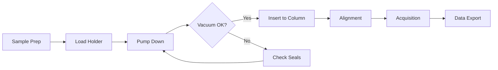
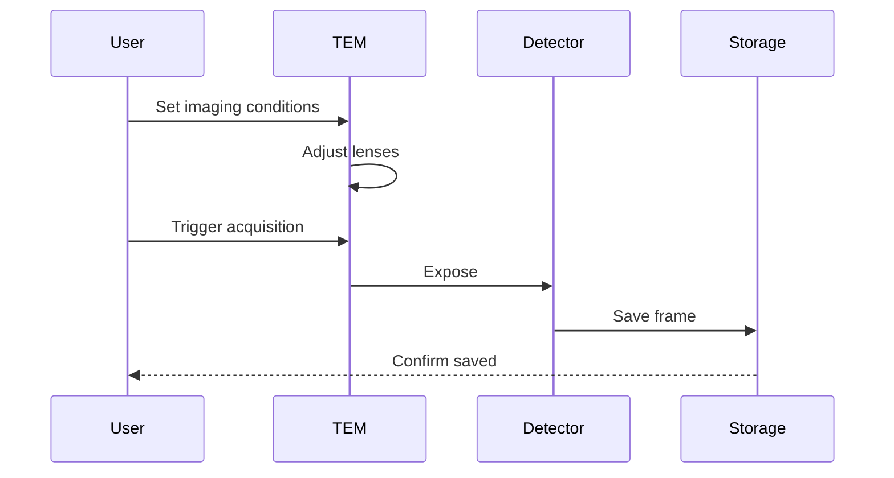
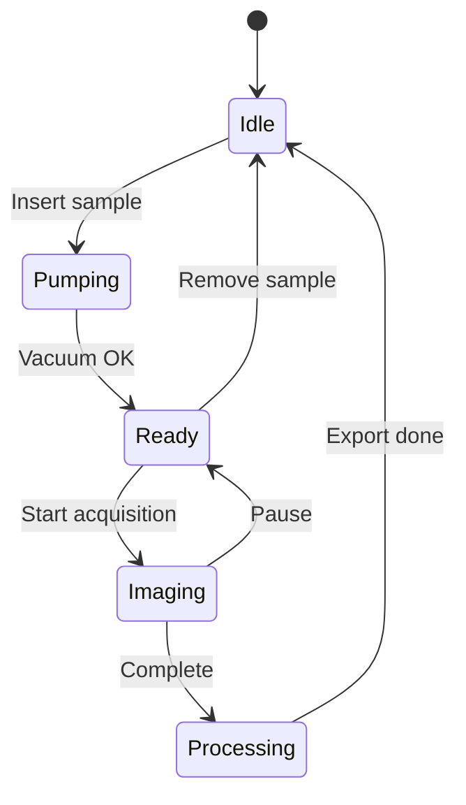

# Style Guide

*A complete reference for beam/shift typography and components.*

---

## Code Blocks

### Python — Image Analysis

```python
import numpy as np
from scipy.fft import fft2, fftshift

def compute_diffraction_pattern(image: np.ndarray) -> np.ndarray:
    """Compute the power spectrum of a TEM image."""
    # Apply Hanning window to reduce edge artifacts
    window = np.hanning(image.shape[0])[:, None] * np.hanning(image.shape[1])
    windowed = image * window

    # Compute 2D FFT and shift zero-frequency to center
    fft_result = fftshift(fft2(windowed))
    power_spectrum = np.abs(fft_result) ** 2

    return np.log1p(power_spectrum)  # Log scale for visualization
```

### JavaScript — Data Pipeline

```javascript
async function fetchMicrographData(sessionId) {
  const response = await fetch(`/api/sessions/${sessionId}/micrographs`);
  const data = await response.json();

  return data.micrographs.map(m => ({
    id: m.id,
    timestamp: new Date(m.acquired_at),
    magnification: m.mag,
    defocus: m.defocus_nm,
  }));
}
```

### Bash — Instrument Commands

```bash
# Connect to TEM control interface
ssh operator@tem-2100f.local

# Check vacuum status
tem-cli vacuum --status

# Start automated acquisition
tem-cli acquire \
  --mode "low-dose" \
  --exposure 0.5 \
  --frames 100 \
  --output ./data/session_$(date +%Y%m%d)/
```

### Inline Code

Accelerating voltage set to `200 kV` with spot size `3`. Camera length: `800 mm`.

---

## Mermaid Diagrams

### Workflow Diagram



### Sequence Diagram



### State Diagram



---

## Admonitions

!!! note "Observation Log"
    Minor astigmatism observed during initial alignment. Contrast optimized after condenser aperture adjustment.

!!! tip "Pro Tip"
    Use the **stigmator controls** in small increments. Over-correction is harder to diagnose than under-correction.

!!! info "System Info"
    Current session: `2100F-20260117-001`
    Operator: Isabel Burgos
    Column vacuum: `2.4 × 10⁻⁵ Pa`

!!! warning "Caution"
    Avoid rapid temperature changes when cooling the sample holder. Thermal shock can damage delicate specimens.

!!! danger "Critical Alert"
    **NEVER** vent the column while the electron gun is on. This will cause irreversible damage to the LaB₆ filament.

!!! abstract "Summary"
    This experiment demonstrates lattice imaging at atomic resolution using aberration-corrected STEM.

??? example "Collapsible Example"
    Click to expand this collapsible section. Useful for hiding verbose output or optional details.

    ```python
    # Hidden code example
    print("Surprise!")
    ```

---

## LaTeX / Mathematics

### Inline Math

The electron wavelength at $200 \text{ kV}$ is approximately $\lambda = 2.51 \text{ pm}$, calculated from the relativistic de Broglie relation.

### Block Equations

The Scherzer defocus for optimal phase contrast:

$$
\Delta f_{Sch} = -1.2 \sqrt{C_s \lambda}
$$

where $C_s$ is the spherical aberration coefficient and $\lambda$ is the electron wavelength.

### Complex Expressions

The contrast transfer function (CTF) for a weak phase object:

$$
CTF(k) = -2 \sin\left[ \pi \lambda k^2 \left( \Delta f + \frac{1}{2} C_s \lambda^2 k^2 \right) \right] \cdot E(k)
$$

The Fourier transform of a 2D Gaussian:

$$
\mathcal{F}\left\{ e^{-\pi(x^2 + y^2)} \right\} = e^{-\pi(k_x^2 + k_y^2)}
$$

---

## Tables

### Acquisition Parameters

| Parameter            | Value        | Units   | Notes              |
|----------------------|--------------|---------|---------------------|
| Accelerating Voltage | 200          | kV      | Standard operation  |
| Objective Aperture   | 40           | µm      | Inserted            |
| Defocus              | −1.5         | µm      | Slight underfocus   |
| Exposure Time        | 0.5          | s       | CCD limited         |
| Magnification        | 120,000      | ×       | —                   |
| Camera Length        | 800          | mm      | Diffraction mode    |

### Detector Comparison

| Detector     | Type    | Pixel Size | DQE (0)  | Frame Rate |
|--------------|---------|------------|----------|------------|
| OneView      | CMOS    | 15 µm      | ~0.80    | 25 fps     |
| K3          | DED     | 5 µm       | ~0.95    | 1500 fps   |
| Rio 16      | CCD     | 9 µm       | ~0.60    | 4 fps      |

---

## Typography

### Text Styles

Regular paragraph text for extended reading. The instrument's phosphor screen glows with that characteristic green.

*Italic text* for metadata, conditions, or interpretive notes.

**Bold text** for emphasis and important values.

~~Strikethrough~~ for deprecated or removed content.

==Highlighted text== for critical information.

### Blockquote

> The electron microscope has revealed a world that exists beyond the limits of visible light — a world of atoms and lattices, of quantum interference and crystalline order.

### Links

- External: [MkDocs Material Documentation](https://squidfunk.github.io/mkdocs-material/)
- Internal: [Back to home](index.md)

---

## Lists

### Unordered

- Sample preparation completed
- Holder loaded and pumped
- Column alignment verified
  - Gun tilt optimized
  - Condenser stigmators adjusted
  - Objective aperture centered

### Ordered

1. Mount sample on grid
2. Insert holder into airlock
3. Wait for vacuum interlock
4. Transfer to column
5. Begin imaging sequence

### Task List

- [x] Initial alignment
- [x] Focus calibration
- [ ] Acquire tilt series
- [ ] Process tomogram

---

## Keyboard Shortcuts

| Action              | Shortcut                    |
|---------------------|----------------------------|
| Toggle beam blank   | <kbd>B</kbd>               |
| Focus step          | <kbd>F1</kbd> / <kbd>F2</kbd> |
| Magnification       | <kbd>M</kbd> + scroll      |
| Screenshot          | <kbd>Cmd</kbd>+<kbd>S</kbd> |

---

## Horizontal Rules

Content above the divider.

---

Content below the divider. Notice the glowing phosphor effect on the rule.

---

*End of style guide. This page exists to preview typography, color, spacing, and layout.*
